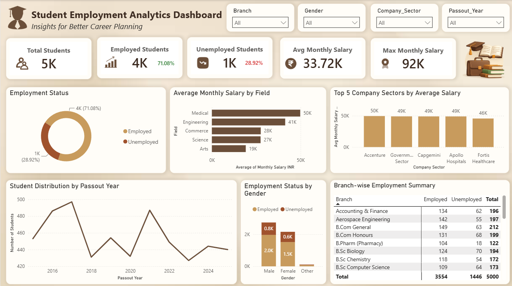
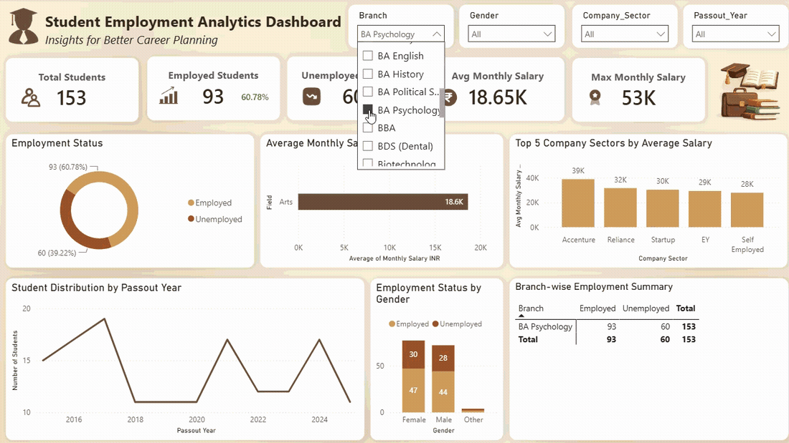

# 🎓 Student Employment Analytics Dashboard

An interactive **Power BI dashboard** built to analyze student employment trends, placement statistics, salary insights, and graduate outcomes. This dashboard enables users to explore employment patterns using interactive filters and visually rich reports.

---

## 📊 Project Overview

The Student Employment Analytics Dashboard provides a comprehensive view of graduate employment data, helping identify trends across branches, fields of study, salaries, company sectors, and passout years.

The dashboard is designed to support data-driven decision-making by presenting key employment metrics through interactive visualizations.

---

## 🚀 Dashboard Features

- 📌 Total Students
- 💼 Employed Students
- ❌ Unemployed Students
- 📈 Employment Rate
- 📉 Unemployment Rate
- 💰 Average Monthly Salary
- 🏆 Maximum Monthly Salary
- 📊 Employment Distribution
- 📚 Average Monthly Salary by Field
- 🏢 Top 5 Company Sectors by Average Salary
- 📅 Student Distribution by Passout Year
- 👨‍🎓 Employment Status by Gender
- 📋 Branch-wise Employment Summary
- 🎛 Interactive Slicers
  - Branch
  - Gender
  - Company Sector
  - Passout Year

---

## 🛠 Tools & Technologies

- Power BI Desktop
- Power Query
- DAX (Data Analysis Expressions)
- Data Modeling
- Microsoft Excel

---

## 📂 Project Structure

```
Student-Employment-Analytics-Dashboard/
│
├── Student Employment Analytics Dashboard.pbix
├── README.md
│
├── Dataset/
│   └── Student_Employment_Dataset.xlsx
│
├── Images/
│   ├── Dashboard.png
│   └── Dashboard.gif
│
└── LICENSE
```

---

## 📸 Dashboard Preview



<!-- If you have a GIF, uncomment the line below -->

<!--  -->

---

## 📈 Key Insights

- Employment rate of graduates is approximately **71%**.
- Engineering has one of the highest student enrollments.
- Medical graduates receive the highest average monthly salary.
- Top company sectors offer salaries up to **₹50K** per month.
- Salary trends vary significantly across different academic fields.

---

## 📊 Dashboard Visuals

- KPI Cards
- Donut Chart
- Clustered Bar Chart
- Column Chart
- Line Chart
- Stacked Column Chart
- Matrix Table
- Interactive Slicers

---

## 💡 Skills Demonstrated

- Data Cleaning using Power Query
- Data Transformation
- Data Modeling
- DAX Measures
- KPI Development
- Interactive Dashboard Design
- Business Intelligence
- Data Visualization
- Analytical Storytelling

---

## 🎯 Learning Outcomes

- Built an end-to-end interactive Power BI dashboard.
- Applied DAX measures for dynamic KPI calculations.
- Designed responsive and user-friendly report layouts.
- Created business-oriented visualizations to uncover employment trends.
- Enhanced dashboard usability through slicers and data modeling.

---

## 📁 Dataset

The dataset used in this project is included in the **Dataset** folder for learning and demonstration purposes.

---

## 👨‍💻 Author

**Ganesh**

- GitHub: https://github.com/ganeshk314
- LinkedIn: https://www.linkedin.com/in/ganeshk314
- Portfolio: https://ganeshkutikuppala.netlify.app/

---

⭐ If you found this project helpful, consider giving it a **Star** on GitHub!
